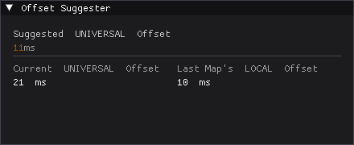

# Offset Suggester for osu!stable

Determine your osu!stable suggested universal offset.  
Ported over from [Pinossaur's tosu overlay](https://github.com/Pinossaur/counters/commit/8e9835eed00ba4ccf09fd1d006572bd2b13c5d72)

</img>

## How it works

Every hit has a **hit error** (ms): +1 = 1ms late, -2 = 2ms early.  
After each map the **median** hit error is computed, this tells you if your audio offset is off.

1. Collects hit errors during play
2. On map finish, computes median hit error
3. Accumulates medians across maps
4. **Suggested offset = universal offset - average of all map medians**

## Why?

I want to share this overlay to my friends without guiding them on how to install [tosu](https://github.com/tosuapp/tosu).  
If you already use [tosu](https://github.com/tosuapp/tosu) then there's really no reason to use this.

## What about osu!lazer?

osu!lazer has this already built in.

## Credits

[tosu](https://github.com/tosuapp/tosu) - osu!stable memory offsets  
[Pinossaur's tosu overlay](https://github.com/Pinossaur/counters/commit/8e9835eed00ba4ccf09fd1d006572bd2b13c5d72)
